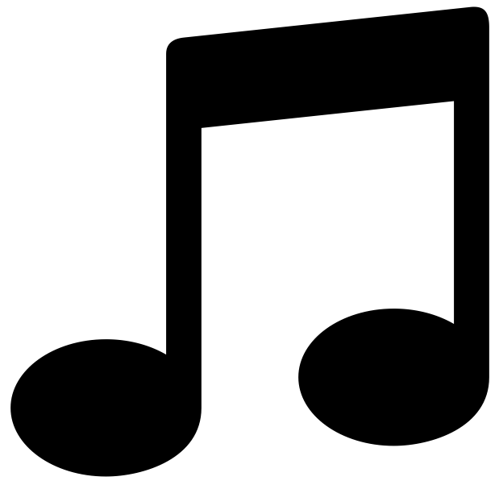
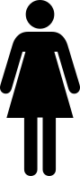
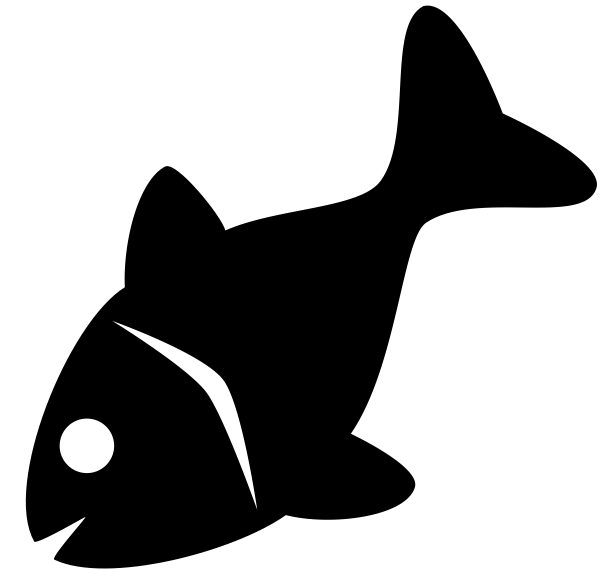
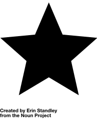
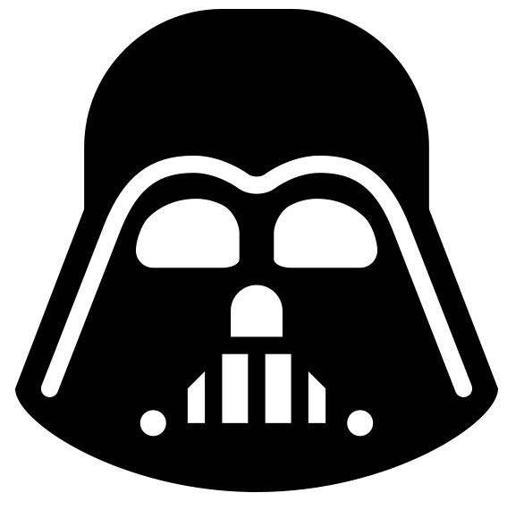
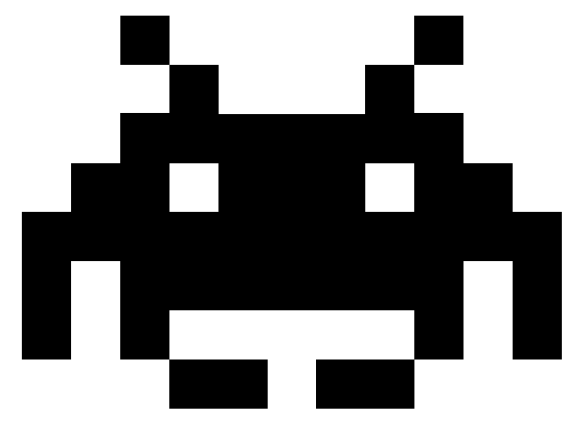
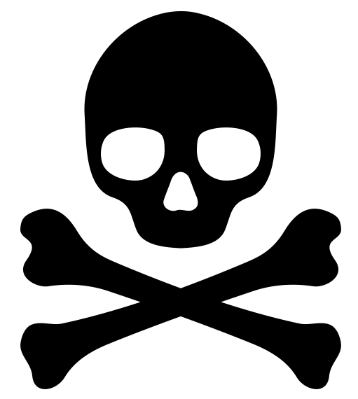

# NXT-Sketcher

NXT-Sketcher is a Lego NXT robot that is gifted in drawing.

It can be built from a single standard Lego NXT Mindstorms set.

No additional lego part, no firmware flashing or software installation is required.

The robot is able to draw most of svg files.

# Installation

- Download the [latest release](https://github.com/simondolle/nxt-sketcher/releases/download/v0.3/nxt-sketcher.zip) and unzip it.
- Build the NXT-Sketcher:
  - Follow the building instructions to build your model.
  - Put the NXT-Sketcher on a paper sheet.
  - Insert a pen in the hole at the intersection of the two arms.
  - Adjust pen height, so that the pen touch the paper when the arm at the rear of the robot is down.
- Download the software to the brick.
  - Start your NXT brick.
  - Open your Mindstorms NXT software.
  - Connect the NXT-Sketcher to your computer (through the USB cable for instance)
  - Create a new project.
  - Open the NXT window.

    

  - Go to the Memory tab.

    

  - Click on Download.
  - Select the nxt-sketcher.rxe file.
  - Following the same procedure download the .svg file you want to draw.
    Some .svg files are provided as samples with the release.
    (On the file selection interface you might have to select "View all" to see the .svg files)
  - You can now disconnect the computer.
- Run the NXT-Sketcher
  - On the NXT brick, run the nxt-sketcher program.
  - Select the file you want to draw with the arrow.
  - Press the orange button to launch the drawing.
- That's it.

# Resources

## Where to find .svg files?

[The Noun project](https://thenounproject.com/) contains a large set of high quality free svg files - distributed with a Creative Commons license.
These files work very well with the NXT-Sketcher.

As svg is a standard file format, you can also find many of them through a Google search.

You can even convert your .jpg, .png or .gif files to .svg with online converters such as http://image.online-convert.com/convert-to-svg

## What pen should I use?

I personally use [Muji mini hexagonal pens](http://www.muji.eu/pages/online.asp?Sec=13&Sub=53&PID=6554).
But almost any kind of pen will work.

# Credits

The [Ev3 Print3rbot](http://www.ev3dev.org/projects/2015/05/06/EV3-Print3rbot/) was a great source of inspiration for the desig of the NXT-Sketcher.
And I am very admirative of his design.

The sample images are downloaded from the [The Noun project](https://thenounproject.com/) and distributed under a Creative Commons license.
-  [Music Note](https://thenounproject.com/term/music-note/55429/): created by Parker Foote
-   [Heart](https://thenounproject.com/term/heart/219/): public domain
-   [Woman](https://thenounproject.com/term/woman/5/): public domain
-   [Cat](https://thenounproject.com/term/cat/70130/): created by Francielly Costantin Senra
-   [Fish](https://thenounproject.com/term/fish/153358/): created by Mario Bieh
-   [Star](https://thenounproject.com/term/star/17639/): created by Erin Standley
-   [Darth Vader](https://thenounproject.com/term/darth-vader/65913/): created by Rohith M S
-   [Invader](https://thenounproject.com/term/space-invader/87949/): created by Melvin Salas
-   [Skull](https://thenounproject.com/term/death/195701/): created by Aha-Soft

# Author

Simon Dollé: <simon.dolle@gmail.com>